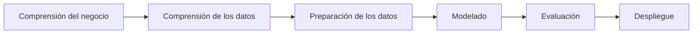
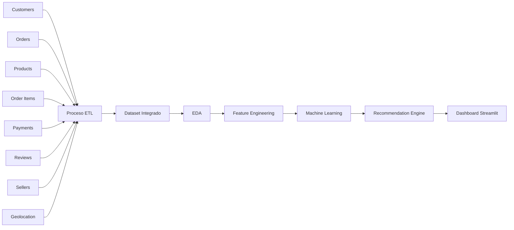

<p align="center">
    
</p>

<h1 align="center">
🛒 Sistema de Recomendación FinCommerce
</h1>

<h3 align="center">
Pipeline End-to-End de Machine Learning para Recomendación Inteligente de Productos
</h3>

<p align="center">


</p>

---

# 📑 Índice

- 📌 Resumen Ejecutivo
- 🚀 Aspectos destacados del proyecto
- 🌟 ¿Por qué este proyecto?
- 💼 Problema de negocio
- 🎯 Objetivos del proyecto
- 📊 Dataset -- Tablas
- 🔄 Flujo general del proyecto
- 🧩 Desafíos del proyecto
- 🏗️ Arquitectura del proyecto
- 🔄 Metodología CRISP-DM
- 📂 Organización del repositorio
- ⚙️ Pipeline ETL
- 🔗 Flujo del pipeline
- 💡 Buenas prácticas implementadas
- 🔬 Análisis Exploratorio de Datos (EDA)
- ⚙️ Ingeniería de Características
- 🤖 Modelado
- 📊 Evaluación del modelo
- 📈 Resultados del entrenamiento
- 💡 Principales aprendizajes
- 🧠 Sistema de recomendación
- 📱 Dashboard interactivo
- 💼 Valor para el negocio
- 📈 Resultados
- 💡 Valor para el negocio
- 🚀 Escalabilidad
- 🛠️ Tecnologías utilizadas
- 📌 Conclusiones
- 🚀 Próximas mejoras
- 📚 Aprendizajes obtenidos
- 👩‍💻 Sobre la autora

---

# 📌 Resumen Ejecutivo

**FinCommerce** es un proyecto **End-to-End de Ciencia de Datos** desarrollado como trabajo final del **Bootcamp de Data Science de Henry**.

El proyecto aborda un problema real del comercio electrónico mediante el desarrollo de un **sistema inteligente de recomendación de productos**, capaz de generar sugerencias personalizadas a partir del comportamiento de compra de los clientes.

La solución integra todas las etapas del ciclo de vida de un proyecto de Ciencia de Datos, desde el proceso de **Extracción, Transformación y Carga de datos (ETL)** y el **Análisis Exploratorio de Datos (EDA)**, hasta la **Ingeniería de Características (Feature Engineering)**, el desarrollo del sistema de recomendación y su despliegue mediante una aplicación interactiva construida con **Streamlit**.

El proyecto fue desarrollado de forma colaborativa siguiendo la metodología **CRISP-DM** y el marco de trabajo **Scrum**, integrando habilidades técnicas, trabajo en equipo y una visión orientada a la resolución de un problema de negocio.

---

# 🚀 Aspectos destacados del proyecto

| Característica | Descripción |
|----------------|-------------|
| 🎯 Objetivo | Sistema inteligente de recomendación de productos |
| 📊 Dataset | Olist Brazilian E-Commerce Dataset |
| 👥 Clientes | +99.000 |
| 📦 Productos | +32.000 |
| 🧾 Pedidos | +100.000 |
| 🤖 Tecnologías de Machine Learning | LightGBM |
| 📈 Evaluación | Precision@K · Recall@K · NDCG |
| 💻 Aplicación | Streamlit |
| 🔄 Metodología | CRISP-DM |
| 👥 Trabajo colaborativo | Scrum + Git + GitHub |

---

# 🌟 ¿Por qué este proyecto?

Las plataformas modernas de comercio electrónico generan diariamente enormes volúmenes de información sobre clientes, productos y transacciones.

Transformar esos datos en **recomendaciones personalizadas** permite:

- Mejorar la experiencia del cliente.
- Incrementar la retención de usuarios.
- Facilitar el descubrimiento de productos.
- Potenciar estrategias de *Cross-selling* y *Up-selling*.
- Generar mayor valor para el negocio.

Este proyecto demuestra cómo la Ciencia de Datos puede convertir datos transaccionales en información accionable mediante el desarrollo de un sistema inteligente de recomendación.

---

# 💼 Problema de negocio

En la actualidad, las plataformas de comercio electrónico administran millones de transacciones y un catálogo cada vez más amplio de productos. A medida que aumenta la cantidad de opciones disponibles, también crece la dificultad para que los clientes encuentren aquellos productos que realmente se ajustan a sus intereses.

Los sistemas de recomendación permiten abordar este problema mediante el análisis del comportamiento de compra de los usuarios para generar sugerencias personalizadas que mejoren la experiencia de compra y aumenten el valor de cada interacción.

Desde la perspectiva del negocio, un sistema de recomendación contribuye a:

- Incrementar la tasa de conversión.
- Mejorar la experiencia del cliente.
- Favorecer estrategias de Cross-selling y Up-selling.
- Incrementar el ticket promedio.
- Mejorar la fidelización de clientes.
- Optimizar la visibilidad de productos.

Este proyecto desarrolla una solución basada en Machine Learning capaz de transformar grandes volúmenes de datos transaccionales en recomendaciones inteligentes y personalizadas.

---

# 🎯 Objetivos del proyecto

## Objetivo general

Desarrollar un sistema inteligente de recomendación de productos utilizando técnicas de Ciencia de Datos y Machine Learning que permita generar sugerencias personalizadas a partir del historial de compras de los clientes.

---

## Objetivos específicos

- Integrar múltiples fuentes de información provenientes del dataset de Olist.
- Diseñar un proceso reproducible de ETL para preparar los datos.
- Realizar un Análisis Exploratorio de Datos (EDA) orientado a comprender el comportamiento de compra.
- Construir variables relevantes mediante técnicas de Ingeniería de Características (*Feature Engineering*).
- Entrenar y comparar diferentes modelos de Machine Learning.
- Seleccionar el modelo con mejor desempeño para el sistema de recomendación.
- Implementar una aplicación interactiva mediante Streamlit.
- Presentar métricas e indicadores que permitan interpretar el funcionamiento del recomendador.

---

# 📊 Dataset

Para el desarrollo del proyecto se utilizó el **Olist Brazilian E-Commerce Public Dataset**, uno de los conjuntos de datos abiertos más utilizados para proyectos de Ciencia de Datos aplicados al comercio electrónico.

El dataset contiene información real anonimizada correspondiente a pedidos realizados entre los años **2016 y 2018**, incluyendo datos de clientes, productos, vendedores, pagos, reseñas y geolocalización.

## Información general

| Característica | Valor |
|----------------|------:|
| Plataforma | Olist Store |
| País | Brasil |
| Clientes | +99.000 |
| Productos | +32.000 |
| Pedidos | +100.000 |
| Vendedores | +3.000 |
| Categorías | +70 |

---

## Tablas utilizadas

Durante el proceso de integración se trabajó con las siguientes tablas:

| Tabla | Descripción |
|--------|-------------|
| Customers | Información de clientes |
| Orders | Información general de pedidos |
| Order Items | Productos incluidos en cada pedido |
| Products | Catálogo de productos |
| Sellers | Información de vendedores |
| Payments | Métodos y valores de pago |
| Reviews | Calificaciones otorgadas por los clientes |
| Geolocation | Información geográfica |

---

# 🔄 Flujo general del proyecto

```text
Dataset Olist
        │
        ▼
Integración de tablas
        │
        ▼
Proceso ETL
        │
        ▼
Análisis Exploratorio (EDA)
        │
        ▼
Ingeniería de Características
        │
        ▼
Entrenamiento de Modelos
        │
        ▼
Sistema de Recomendación
        │
        ▼
Aplicación Streamlit
```

---

# 🧩 Desafíos del proyecto

El desarrollo del recomendador implicó enfrentar diversos desafíos propios de los sistemas de recomendación aplicados al comercio electrónico.

Entre los principales se destacan:

- Integración de múltiples tablas relacionadas.
- Limpieza y normalización de grandes volúmenes de datos.
- Construcción de variables relevantes para el modelo.
- Tratamiento de datos faltantes.
- Reducción de la dispersión de productos (*long tail*).
- Manejo del problema de *cold start*.
- Evaluación del rendimiento mediante métricas específicas para sistemas de recomendación.
- Diseño de una interfaz intuitiva para usuarios finales mediante Streamlit.

---

# 🏗️ Arquitectura general del proyecto

El proyecto fue diseñado siguiendo una arquitectura modular que separa claramente las etapas de adquisición, procesamiento, modelado y visualización de los datos.

Cada componente cumple una función específica dentro del pipeline, facilitando la reutilización del código, el mantenimiento y la escalabilidad del sistema.

```text
                  OLIST DATASET
                        │
                        ▼
          ┌────────────────────────┐
          │ Extracción de datos    │
          └────────────────────────┘
                        │
                        ▼
          ┌────────────────────────┐
          │ Limpieza de datos      │
          └────────────────────────┘
                        │
                        ▼
          ┌────────────────────────┐
          │ Integración de tablas  │
          └────────────────────────┘
                        │
                        ▼
          ┌────────────────────────┐
          │ Feature Engineering    │
          └────────────────────────┘
                        │
                        ▼
          ┌────────────────────────┐
          │ Machine Learning       │
          └────────────────────────┘
                        │
                        ▼
          ┌────────────────────────┐
          │ Recommendation Engine  │
          └────────────────────────┘
                        │
                        ▼
          ┌────────────────────────┐
          │ Dashboard Streamlit    │
          └────────────────────────┘
```

---

# 🔄 Metodología de trabajo

El proyecto fue desarrollado siguiendo la metodología **CRISP-DM (Cross Industry Standard Process for Data Mining)**, ampliamente utilizada en proyectos profesionales de Ciencia de Datos.

Esta metodología permitió estructurar el desarrollo en etapas claramente definidas, facilitando tanto la planificación como la evaluación continua del proyecto.



---

## Aplicación de CRISP-DM

| Etapa | Actividades desarrolladas |
|--------|---------------------------|
| Comprensión del negocio | Definición del problema de recomendación de productos |
| Comprensión de los datos | Exploración del dataset Olist |
| Preparación de datos | ETL, limpieza, integración y transformación |
| Modelado | Entrenamiento y comparación de modelos |
| Evaluación | Métricas específicas para sistemas de recomendación |
| Despliegue | Desarrollo del Dashboard en Streamlit |

---

# 👥 Metodología de trabajo en equipo

El proyecto fue desarrollado bajo un enfoque **ágil**, utilizando la metodología **Scrum** para organizar el trabajo colaborativo.

Durante el desarrollo se utilizaron:

- Git
- GitHub
- Pull Requests
- Branches
- Revisión de código
- Reuniones de seguimiento
- Distribución de tareas

La utilización de Git permitió mantener un historial completo de cambios y facilitar el trabajo simultáneo entre los integrantes del equipo.

---

# 📂 Organización del repositorio

La estructura del proyecto fue diseñada para mantener una separación clara entre los datos, notebooks, aplicación y recursos gráficos.

```text
FinCommerce-Recommendation-System
│
│
├── app/
│   └── streamlit_app.py
│   
│
├── data/
│   ├── dataset_modelo.csv
│   └── product_category_name_translation.csv
│    
│
├── images/
│   └── E-Commerce Banner.png
│
│
├── models/
│   └── lightgbm_recommender.joblib
│
│
├── notebooks/
│   ├── 01_EDA_Explorativo.ipynb
│   ├── 02_EDA_ETL.ipynb
│   ├── 03_Modelado.ipynb
│   ├── 03_Modelado_v1.ipynb
│   └── 04_Validacion_despliegue.ipynb
│
│
├── README.md
│
│
├── notebooks/
│
│
├──app_vq.py
│
│
└── requirements.txt 
```

---

# ⚙️ Pipeline ETL

Uno de los principales desafíos del proyecto consistió en integrar múltiples tablas provenientes del dataset de Olist para construir una base de datos consistente.

El proceso ETL desarrollado incluyó las siguientes etapas.

## Extracción

Se importaron las tablas originales del dataset:

- Customers
- Orders
- Order Items
- Products
- Sellers
- Reviews
- Payments
- Geolocation

---

## Transformación

Durante esta etapa se realizaron diversas tareas de preparación de datos:

- Eliminación de registros duplicados;
- Tratamiento de valores faltantes;
- Unificación de claves primarias y foráneas;
- Normalización de variables;
- Transformación de tipos de datos;
- Generación de nuevas variables;
- Construcción de tablas derivadas.

Estas transformaciones permitieron obtener un conjunto de datos consistente para el entrenamiento de los modelos.

---

## Carga

Finalmente se generó un dataset consolidado utilizado en las etapas posteriores de:

- Análisis exploratorio;
- Entrenamiento;
- Evaluación;
- Sistema de recomendación;
- Aplicación Streamlit.

---

# 🔗 Flujo del pipeline



---

# 💡 Buenas prácticas implementadas

Durante el desarrollo del proyecto se aplicaron diversas buenas prácticas orientadas a mejorar la calidad del código y la reproducibilidad del análisis.

Entre ellas se destacan:

- Estructura modular del proyecto;
- Separación entre datos crudos y procesados;
- Uso de notebooks organizados por etapas;
- Control de versiones mediante Git;
- Documentación del proyecto;
- Desarrollo colaborativo mediante Pull Requests;
- Aplicación de la metodología CRISP-DM.

---

# 🔬 Análisis Exploratorio de Datos (EDA)

Antes de construir el sistema de recomendación se realizó un Análisis Exploratorio de Datos (EDA) con el objetivo de comprender la estructura del conjunto de datos, identificar posibles problemas de calidad y descubrir patrones relevantes para el negocio.

El análisis permitió responder preguntas como:

- ¿Cómo se distribuyen las compras a lo largo del tiempo?
- ¿Qué categorías concentran la mayor cantidad de ventas?
- ¿Existen productos con muy baja rotación?
- ¿Cómo se comportan las calificaciones de los clientes?
- ¿Qué relación existe entre las compras y las formas de pago?
- ¿Qué regiones presentan mayor actividad comercial?

---

## Objetivos del EDA

El análisis exploratorio permitió:

- Comprender la estructura general del dataset.
- Detectar valores faltantes y registros inconsistentes.
- Identificar variables relevantes para el sistema de recomendación.
- Analizar el comportamiento de compra de los clientes.
- Evaluar la distribución de productos y categorías.
- Obtener información útil para la etapa de Ingeniería de Características.

---

## Principales análisis realizados

Durante esta etapa se desarrollaron diferentes visualizaciones y análisis estadísticos, entre ellos:

- Distribución temporal de pedidos.
- Productos más vendidos.
- Categorías con mayor volumen de ventas.
- Distribución geográfica de clientes.
- Distribución de vendedores.
- Formas de pago utilizadas.
- Cantidad de productos por pedido.
- Distribución de calificaciones.
- Productos con mayor frecuencia de compra.
- Relación entre ventas y categorías.

---

## Visualizaciones

> 📷 **Agregar aquí las principales figuras obtenidas durante el EDA.**

Ejemplo:

```
images/
│
├── eda_orders_per_month.png
├── eda_top_categories.png
├── eda_reviews.png
├── eda_payment_methods.png
└── eda_heatmap.png
```

---

# ⚙️ Ingeniería de Características

Una vez comprendido el comportamiento de los datos, se construyó un conjunto de variables derivadas destinadas a mejorar la capacidad predictiva del modelo.

La Ingeniería de Características constituyó una de las etapas más importantes del proyecto, ya que permitió representar de manera más eficiente el comportamiento histórico de compra de los clientes.

---

## Principales transformaciones

Entre las transformaciones realizadas se incluyen:

- Construcción de variables agregadas.
- Codificación de variables categóricas.
- Generación de indicadores de frecuencia.
- Normalización de variables numéricas.
- Integración de información proveniente de distintas tablas.
- Eliminación de variables redundantes.
- Optimización del conjunto de entrenamiento.

---

## Variables consideradas

Algunas de las variables utilizadas incluyen información relacionada con:

- Cliente.
- Producto.
- Categoría.
- Pedido.
- Vendedor.
- Pago.
- Calificación.
- Fecha de compra.

Estas variables permitieron construir una representación más completa del historial de compras y mejorar el desempeño del sistema de recomendación.

---

# 🤖 Modelado

Con el conjunto de datos preparado se procedió al entrenamiento y evaluación de distintos modelos de Machine Learning.

El objetivo fue identificar el algoritmo con mejor capacidad para generar recomendaciones relevantes y consistentes.

---

## Flujo de modelado

```text
Dataset Integrado
        │
        ▼
División de datos
        │
        ▼
Entrenamiento
        │
        ▼
Evaluación
        │
        ▼
Comparación de modelos
        │
        ▼
Selección del modelo final
```

---

## Modelos evaluados

Durante el proyecto se analizaron diferentes enfoques de modelado.

| Modelo | Objetivo |
|---------|----------|
| Baseline | Establecer una referencia inicial |
| LightGBM | Modelo seleccionado |
| Comparación de enfoques | Evaluar alternativas para el sistema de recomendación |

> **Nota:** LightGBM fue seleccionado por su capacidad para manejar grandes volúmenes de datos, su eficiencia computacional y su buen desempeño en problemas de aprendizaje supervisado.

---

# 📊 Evaluación del modelo

A diferencia de un problema clásico de clasificación o regresión, un sistema de recomendación requiere métricas específicas que permitan evaluar la calidad de las sugerencias generadas.

Para ello se utilizaron indicadores ampliamente empleados en la literatura.

| Métrica | Descripción |
|----------|-------------|
| Precision@K | Proporción de recomendaciones relevantes entre las K sugerencias realizadas. |
| Recall@K | Capacidad del sistema para recuperar productos relevantes. |
| NDCG | Evalúa tanto la relevancia como el orden de las recomendaciones. |

Estas métricas permiten medir el desempeño del sistema desde la perspectiva del usuario final, priorizando la utilidad práctica de las recomendaciones.

---

# 📈 Resultados del entrenamiento

El modelo seleccionado demostró un desempeño consistente en las distintas evaluaciones realizadas durante el proyecto.

Su utilización permitió generar recomendaciones personalizadas a partir del historial de compras de los clientes, constituyendo la base del motor de recomendación implementado posteriormente en la aplicación interactiva.

> 📷 **Agregar aquí la tabla comparativa de resultados y las métricas obtenidas durante el entrenamiento.**

---

# 💡 Principales aprendizajes

El proceso de modelado permitió comprender la importancia de:

- La calidad de los datos;
- La Ingeniería de Características;
- La correcta selección de métricas de evaluación;
- La interpretación de resultados desde una perspectiva de negocio.

Más allá del desempeño del algoritmo, el éxito de un sistema de recomendación depende de la integración de todas las etapas del pipeline de Ciencia de Datos.

---

# 🧠 Sistema de recomendación

El núcleo del proyecto es un sistema de recomendación diseñado para transformar el historial de compras de los clientes en sugerencias personalizadas de productos.

A partir de la información integrada durante el proceso ETL, el sistema identifica patrones de comportamiento y genera recomendaciones orientadas a mejorar la experiencia de compra.

El objetivo no consiste únicamente en recomendar productos populares, sino en ofrecer sugerencias relevantes para cada cliente, contribuyendo al descubrimiento de nuevos productos y aumentando las oportunidades de venta.

---

## Flujo del sistema de recomendación

```text
Historial de compras
            │
            ▼
Preprocesamiento de datos
            │
            ▼
Construcción de características
            │
            ▼
Algoritmo de recomendación
            │
            ▼
Ranking de productos
            │
            ▼
Aplicación de reglas de negocio
            │
            ▼
Top-N recomendaciones
            │
            ▼
Dashboard Streamlit
```

---

## Funcionamiento general

El pipeline del recomendador puede resumirse en las siguientes etapas:

1. Integración de la información de clientes, pedidos y productos.
2. Preparación y transformación de los datos.
3. Construcción de variables relevantes.
4. Generación del ranking de productos recomendados.
5. Visualización de resultados mediante Streamlit.

---

# 📱 Dashboard interactivo

Como etapa final del proyecto se desarrolló una aplicación interactiva utilizando **Streamlit**, permitiendo explorar el sistema de recomendación desde una interfaz sencilla e intuitiva.

El dashboard fue diseñado para facilitar la interpretación de los resultados obtenidos durante el análisis.

---

## Funcionalidades principales

La aplicación permite:

- Visualizar indicadores generales del negocio;
- Explorar el comportamiento del dataset;
- Consultar información de clientes y productos;
- Obtener recomendaciones personalizadas;
- Analizar métricas del sistema de recomendación.

---

## Principales indicadores

Dentro del dashboard se incorporaron distintos KPIs para resumir el comportamiento general del negocio.

Entre ellos se incluyen:

- Cantidad de clientes;
- Cantidad de productos;
- Pedidos registrados;
- Categorías disponibles;
- Vendedores;
- Volumen total de ventas.

---

## Métricas del sistema de recomendación

El rendimiento del recomendador fue evaluado utilizando métricas específicas para este tipo de sistemas.

| Métrica | Objetivo |
|----------|----------|
| Precision@K | Relevancia de las recomendaciones generadas |
| Recall@K | Cobertura de productos relevantes |
| NDCG | Calidad del ordenamiento del ranking |

Estas métricas permiten evaluar la utilidad práctica del sistema desde la perspectiva del usuario final.

---

## Capturas de la aplicación

> 📷 Agregar aquí las principales capturas del Dashboard Streamlit.

Se recomienda incluir imágenes de:

- Página principal;
- Indicadores generales;
- Recomendaciones obtenidas;
- Visualizaciones interactivas;
- Filtros disponibles.

---

# 💼 Valor para el negocio

Los sistemas de recomendación representan una de las aplicaciones más importantes de la Ciencia de Datos dentro del comercio electrónico.

Una implementación adecuada puede contribuir a:

- Mejorar la experiencia del cliente;
- Incrementar la conversión;
- Aumentar el ticket promedio;
- Favorecer estrategias de cross-selling;
- Potenciar el descubrimiento de productos;
- Mejorar la fidelización de clientes.

Aunque este proyecto fue desarrollado con fines educativos, reproduce las principales etapas utilizadas en soluciones reales implementadas por empresas del sector.

---


# 🚀 Escalabilidad

La arquitectura desarrollada permite incorporar futuras mejoras sin modificar la estructura general del proyecto.

Entre las posibles extensiones se encuentran:

- Sistemas híbridos de recomendación;
- Filtrado colaborativo basado en usuarios;
- Filtrado colaborativo basado en productos;
- Recomendaciones en tiempo real;
- Despliegue mediante Docker;
- Seguimiento de experimentos con MLflow;
- Integración con servicios en la nube;
- Automatización del pipeline mediante herramientas de orquestación.

---

# 🛠️ Tecnologías utilizadas

## Lenguajes

<p>


</p>

---

## Ciencia de Datos

- Pandas
- NumPy
- Scikit-learn
- LightGBM
- Matplotlib
- Plotly

---

## Visualización

- Streamlit

---

## Desarrollo

<p>


</p>

---

## Metodologías

- CRISP-DM
- Scrum
- Git Flow
- Desarrollo colaborativo

---

# 🎯 Competencias demostradas

Este proyecto permitió desarrollar y aplicar competencias técnicas y profesionales propias de un proyecto de Ciencia de Datos de punta a punta.

## Ciencia de Datos

- ETL
- Integración de datos
- Limpieza de datos
- Análisis Exploratorio (EDA)
- Ingeniería de Características
- Modelado
- Evaluación de modelos
- Sistemas de recomendación

---

## Ingeniería de Software

- Organización modular del proyecto
- Control de versiones
- Pull Requests
- Trabajo colaborativo
- Documentación técnica

---

## Comunicación

- Storytelling con datos
- Visualización de información
- Comunicación de resultados
- Desarrollo de dashboards interactivos

---

# 👥 Trabajo en equipo

FinCommerce fue desarrollado como proyecto final del Bootcamp de Data Science de Henry bajo una modalidad colaborativa.

El proyecto se organizó utilizando principios de **Scrum**, distribuyendo responsabilidades entre los integrantes del equipo y utilizando GitHub como plataforma para el desarrollo colaborativo y el control de versiones.

Esta experiencia permitió fortalecer habilidades técnicas y de comunicación, fundamentales para el trabajo en equipos multidisciplinarios.

---


# 📌 Conclusiones

FinCommerce permitió integrar todas las etapas de un proyecto de Ciencia de Datos dentro de un mismo flujo de trabajo, desde la comprensión del problema de negocio hasta el desarrollo de una aplicación interactiva para usuarios finales.

A lo largo del proyecto se abordaron desafíos relacionados con la integración de múltiples fuentes de datos, el procesamiento de grandes volúmenes de información, la generación de recomendaciones personalizadas y la comunicación de resultados mediante visualizaciones interactivas.

Más allá del desarrollo técnico, este proyecto permitió fortalecer competencias vinculadas con el trabajo colaborativo, la organización mediante metodologías ágiles y la construcción de soluciones orientadas a resolver problemas reales del negocio.

---

# 🚀 Próximas mejoras

El proyecto fue diseñado con una arquitectura que facilita su evolución.

Entre las posibles líneas de trabajo futuras se incluyen:

- Implementación de sistemas híbridos de recomendación;
- Incorporación de nuevos algoritmos de ranking;
- Recomendaciones en tiempo real;
- Integración con APIs de comercio electrónico;
- Seguimiento de experimentos mediante MLflow;
- Despliegue utilizando Docker;
- Integración con servicios Cloud;
- Automatización del pipeline de datos.

---

# 📚 Aprendizajes obtenidos

Durante el desarrollo del proyecto se consolidaron conocimientos relacionados con:

- Procesamiento de datos;
- Integración de múltiples fuentes de información;
- Construcción de sistemas de recomendación;
- Evaluación mediante métricas específicas;
- Desarrollo de aplicaciones con Streamlit;
- Documentación profesional de proyectos;
- Trabajo colaborativo utilizando Git y GitHub.

---

# 👩‍💻 Sobre la autora

## Vanina Cavallin

**Ph.D. en Ciencias Biológicas | Data Scientist | Data Analyst**

Soy Doctora en Ciencias Biológicas con formación en Ciencia de Datos y experiencia en investigación científica, análisis de datos y desarrollo de modelos de Machine Learning.

Mi interés se centra en transformar datos en conocimiento útil para apoyar la toma de decisiones y desarrollar soluciones que generen impacto real.

Actualmente continúo ampliando mis conocimientos en Ciencia de Datos, Machine Learning y Analítica aplicada a negocios.

---

## 🌐 Contacto

<p align="center">

<a href="https://github.com/VaninaCavallin">

</a>

<a href="https://www.linkedin.com/in/vanina-cavallin">

</a>

<a href="mailto:vaninacavallin@gmail.com?subject=Consulta%20sobre%20FinCommerce">

</a>

</p>

---

<p align="center">

⭐ Si este proyecto te resultó interesante, no olvides dejar una estrella en el repositorio.

</p>

---
